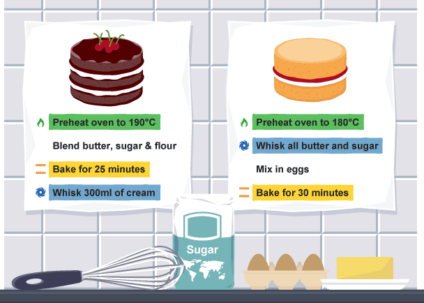
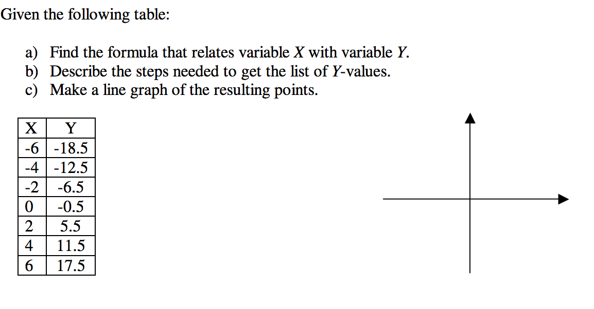

#  Computational Thinking

### LEARNING OBJECTIVES
*After this lesson, you will be able to:*

- Have an overview of what computational thinking means.
- Explain different practices of computational thinking and how they relate to computers.
- Explain the importance of decomposition, pattern recognition, abstraction, and algorithms.

## Introduction: What is Computational Thinking?

- Watch this short [video](https://www.youtube.com/watch?v=SVVB5RQfYxk) on how Google uses computational thinking.

**Computational thinking** is a problem-solving process that includes:

- **Decomposition**: Breaking down data, processes, or problems into smaller, more manageable parts.
- **Pattern Recognition**: Observing patterns, trends, and regularities in data.
- **Abstraction**: Identifying the general principles that generate these patterns. This involves filtering out the details we do not need in order to solve a problem.
- **Algorithm Design**: Developing the step-by-step instructions for solving these and similar problems.

**Scenario-Based Application**

- Historically, a recession occurs in the United States every four to seven years. Studying the patterns that lead to recessions is an example of what?

- Matt is a first grader. He is asked to describe how to draw a cat. In order to a draw a cat, Matt needs to know that a cat has a tail, fur, and eyes. He does not need to know what sound a cat makes or what a cat likes to eat. What is this an example of?

- Carmen is asked to read the poem <i>Fire and Ice</i> by Robert Frost. She is then asked to analyze the meter, rhyme, imagery, structure, tone, diction, and meaning of the poem. What is this an example of?

- You have been asked to share your favorite recipe for chocolate chip cookies. You write down the step-by-step instructions that must be followed to ensure the perfect chewy cookie. What is this an example of?

**Why is this important?**:

> "Computational thinking gives students the freedom and flexibility in finding new effective solutions supported by analysis and validation of the results. It helps students decompose the problem into manageable steps, employ abstraction to deal with complexity, recognize patterns and create scalable algorithms to solve real world problems. Another important skill associated with computational thinking is the ability to collect and analyze data using proper tools and techniques to derive meaningful conclusions." (Work in Progress: Teaching Computational Thinking in Middle and High School)

## How does Computational Thinking Relate to Computers?

Getting computers to help us solve a real-world problem starts with thinking about what steps need to be taken to solve the problem. We then need to use our technical skills to actually get the computer to follow a series of steps.

Although it is sometimes thought that computers do much of the heavy lifting, we actually need to tell the computer exactly what steps to follow and in what order.

#### Example

For example, imagine that you are creating a login system for your cool new website. You need to tell the computer that if a user is visiting your site for the first time, you need him or her to sign up, and that you want to securely store their username and password in a database.

However, if your user is a returning client, you want to allow him or her to enter a username and password, and have the system check whether or not those credentials match what is stored. You then need to specify what happens next: is your user redirected to their profile, or some other page?

#### Challenge 1:

Below you will find various applications of computational thinking as it relates to computer science. Based on what you have learned in this lesson, fill in this table by categorizing each as **decomposition**, **pattern recognition**, **abstraction**, or **algorithms**.

| TYPE  | Application |
|---|---|
| | Realize complex data structures require less code than complex programming.  |
| | Visualize data comparing microchip material and computer speed to notice a trend. |
| | Write a computer program to sort data. |
| |Break a computational graph problem into four sections, each one to be completed by a different computer processor. |

#### Challenge 2:

Let's visit [Robby's Resume](http://www.rleonardi.com/interactive-resume/) together. With a partner, I would like you to discuss how computational thinking was applied when creating this website. Here are some guiding questions that you should discuss with your partner:

If tasked with the challenge of creating an interactive resume,

- How would Robby break this challenge into smaller, more approachable pieces? (decomposition)
- What patterns could Robby come up with to help him streamline his creation process? (pattern recognition)
- What principles govern these patterns, and what can we filter out when thinking about how to approach this challenge? (abstraction)
- What are the specific steps that would need to be followed to create one aspect of the site? (algorithm)

>**Check:** In your own words, how would you describe the different components of computational thinking? What is an example of decomposition, pattern recognition, abstraction, and algorithm design?

## More on Decomposition
Decomposition involves breaking down a complex problem into smaller parts that are more approachable and easier to comprehend. If you do not decompose a problem, the problem can seem overwhelming and harder to solve. Breaking a problem down into smaller pieces means that you can examine each smaller piece in detail.

#### Challenge:

Solve the following riddle; approach it by using decomposition.

A detective who was mere days away from cracking an international oil-smuggling ring has suddenly gone missing. While inspecting his last-known location, officers find a note:

710 57735 34 5508 51 7718

Currently there are 3 suspects: Bill, John, and Todd.

Can you break the detective's code and find the criminal name?

#### More on Recognizing Patterns
Pattern recognition involves finding similarities among different problems or even amongst the decomposed pieces of a more complex problem. This approach is important because problems are easier to solve when they share patterns.

#### Challenge:

In the diagram below, what are some common patterns that you notice in the steps for making each cake?

>Instructor note: Some patterns that students could point out are "preheat the oven to specific temperature," "bake for a specific time."

## More on Abstraction
Abstraction involves filtering out what we do not need to better concentrate on what we do need to solve a problem. This is an important strategy because it allows us to only focus on what really matters, which in turn will make patterns more transparent.

#### Challenge:

Use abstraction to answer the following questions:

a) In all daily planners, no matter the color or design, what should you find?
>Instructor note: Represent a week in terms of days and hours.

b) In all world maps, what is needed to describe the location of a specific place?
>Instructor note: latitude and longitude.

## More on Algorithms

To reiterate, an algorithm is composed of a series of step-by-step instructions that can be used to solve a problem or carry out a task. Algorithms are very detailed and also sequential. It is possible to develop an algorithm or test it without writing any code, but technology can be quite useful for carrying out many steps of an algorithm more quickly.

#### Challenge:

With a partner, write down the steps that need to be followed so that an application that monitors the room temperature will automatically adjust so the room always remains at a certain temperature.

Again, the goal is to think through the problem and break it down into simple steps.

## Bringing it Together: Practice

#### Challenge 1:

I want you to sum up all of the numbers between 1 and 200. Let's break down this problem.

- Let's start with **decomposition**. How can we break up this problem into smaller, more approachable pieces? Hint: Begin adding pairs at the ends of the range, e.g., 200+1.  

- Now let's move into **pattern recognition**. As you added the pairs at the ends of the range above, what pattern arose, if any? What does this tell us? If the pairs all add up to the same number, how many of these pairs will we have?

- Next, let's apply **abstraction**. What can we pull from the pattern and apply to the sum of the numbers in any range that begins with 1 (say, for example, 1 & 5,000)? Focus only on the principles that really matter and would impact any problem like this one.

- Let's now end by creating an **algorithm**. You will essentially be coming up with sequential steps that could be applied when trying to find the sum of all the numbers in any range that begins with 1.

#### Challenge 2:

This exercise will be a lot more freeform than the last. You should work on this either independently or with a partner, and you should apply all of the tactics we learned in class today.

Remember to break the problem down (decomposition), look for patterns when looking at how each `x` relates to its corresponding `y` (pattern recognition), focus on just the information that you need to solve the problem (abstraction), and come up with a summary of steps you would need to follow to solve this problem again (algorithm).

##Additional Resources
- [Google Course](https://computationalthinkingcourse.withgoogle.com/unit?lesson=8&unit=1)
- [Carnegie Mellon Article](https://www.cs.cmu.edu/~15110-s13/Wing06-ct.pdf)
- [Video](https://www.youtube.com/watch?v=QpVqwZ2ce6g) on how Google used computational thinking when thinking about internet access from balloons
- [Computational Thinking with Scratch Article](http://scratched.gse.harvard.edu/ct/defining.html)
- [Algorithm Practice](https://computationalthinkingcourse.withgoogle.com/unit?unit=2&lesson=3)
